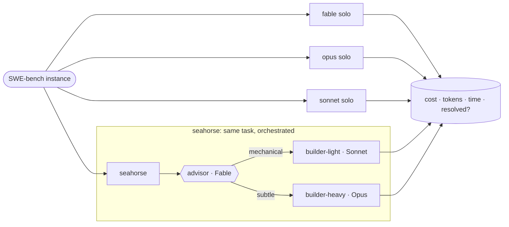
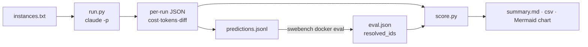
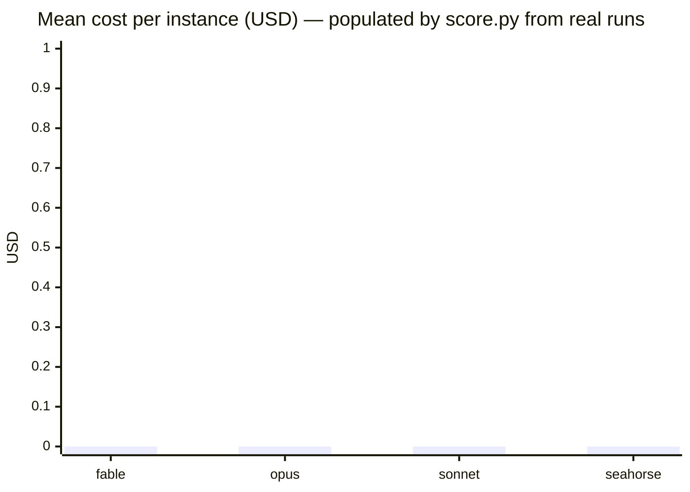

# 🐚 Seahorse — advisor→executor orchestration for Claude Code

Seahorse turns Claude Code into an **advisor→executor orchestration layer**: one architect model plans,
cheaper specialist models build, every unit of work is routed to the model that does it best — under a
strict token diet, over a live project knowledge graph, with typeset output.

> **Seahorse** = the whole framework this repo installs.
> The token-discipline layer (**caveman** = talk less, **ponytail** = write less code) ships vendored in `vendor/`.

## What it wires together

| Concern | Tooling |
|---------|---------|
| Talk less / write less code | [caveman](https://github.com/JuliusBrussee/caveman) + [ponytail](https://github.com/DietrichGebert/ponytail) (vendored, MIT) |
| Plan → delegate → verify | **Fable** advisor → **Sonnet/Opus** executors → **GPT** (Codex) review |
| Research | `/research`, `/deep-research`, dynamic Workflows, arXiv (alphaXiv MCP), primary sources |
| Knowledge graph | [graphify](https://github.com/safishamsi/graphify) → [OKF](https://github.com/GoogleCloudPlatform/knowledge-catalog/blob/main/okf/SPEC.md) |
| Hold work across turns | `/goal`, `/workflows` |
| Outputs | PDFs = **LaTeX/tectonic**, diagrams = **Mermaid** |
| CI/CD | GitHub Actions templates (lint → type → test → build) |

See [`docs/architecture.md`](docs/architecture.md) for the flow diagrams and the full routing table.

## Install

Seahorse ships **two ways**, because Claude Code has two extension models and each has a trade-off.

### A. As a plugin (shareable, versioned) — skills are namespaced `/seahorse:seahorse`

```bash
claude plugin marketplace add Archit3115/seahorse
claude plugin install seahorse@seahorse
# optional companion token-discipline plugins (vendored in this repo):
claude plugin install caveman@seahorse ponytail@seahorse
```

Or ask Claude to do it for you after cloning — those are the two commands it runs.

**Auto-install on clone:** this repo carries a `.claude/settings.json` that pre-registers the marketplace
and enables the plugins. When you open Claude Code **inside the cloned repo** and trust the folder, Claude
Code can offer to install them without you typing the commands. This only affects sessions started in this
directory, and — being third-party code — it still asks for your consent. There is **no** silent
install-on-`git clone`; that would be a security hole, and Claude Code does not do it. If your version
doesn't prompt, run the two commands above.

Local dev without installing: `claude --plugin-dir /path/to/seahorse`.

### B. As standalone `~/.claude` config — gives you the **bare** `/seahorse` command

Plugin skills are always namespaced (`/seahorse:seahorse`). If you want the bare `/seahorse`, run the
installer, which copies the contract, agents, and commands into `~/.claude`:

```bash
./install.sh
```

It merges (never clobbers) your global `CLAUDE.md`, installs the four agents and four commands (including
the bare `/seahorse`), and wires the SessionStart bootstrap hook. Optional tooling it points you at:
`tectonic` (LaTeX PDFs), `uv` + `graphifyy` (knowledge graph), `codex` CLI + `codex login` (GPT review).

**Which to pick:** plugin for clean, versioned, shareable install; installer if you specifically want the
bare `/seahorse` and the global contract. They coexist — a `--plugin-dir` copy wins for its session.

## Layout

```
seahorse/
├── .claude-plugin/
│   ├── plugin.json                # plugin manifest (the seahorse plugin)
│   └── marketplace.json           # marketplace: seahorse + vendored caveman + ponytail
├── .claude/settings.json          # auto-install pre-config (trust-prompt, this dir only)
├── commands/                      # /seahorse · /research · /kg · /pdf  (namespaced under the plugin)
├── agents/                        # advisor · researcher · builder-heavy · builder-light
├── hooks/
│   ├── hooks.json                 # plugin SessionStart hook
│   ├── seahorse-activate.sh       # injects the compact operating contract
│   └── seahorse-bootstrap.sh      # standalone-install project-bootstrap signal (gated to ~/Work)
├── contract/
│   ├── CLAUDE.global.md           # → ~/.claude/CLAUDE.md (standing contract)
│   ├── CLAUDE.project.template.md # per-project contract template
│   └── settings.snippet.json      # SessionStart hook snippet for the standalone install
├── vendor/                        # caveman + ponytail forks (MIT, attribution preserved)
├── benchmarks/                    # SWE-bench harness: Fable vs Opus vs Sonnet vs Seahorse
├── docs/architecture.md           # Mermaid diagrams + routing table
├── templates/ci/                  # node.yml · python.yml
└── install.sh                     # standalone ~/.claude installer
```

## How a task flows

1. `/seahorse <task>` → **advisor** (Fable) returns a chunk→model table + a `/goal` condition.
2. You approve → each chunk goes to its executor (`builder-light`=Sonnet, `builder-heavy`=Opus,
   `/codex:*`=GPT), verified adversarially.
3. `/goal` holds the end-state across turns; `/workflows` runs deterministic fan-outs.
4. Research → `/research` / `/deep-research` (Opus, primary sources, cited).
5. Docs → `/pdf` (LaTeX/tectonic); diagrams → Mermaid; `/kg` keeps the knowledge graph fresh.

A project's own `.claude/CLAUDE.md` always overrides Seahorse.

## Does it actually help? — benchmarks

[`benchmarks/`](benchmarks/) is a harness that runs coding tasks through Claude Code under four conditions —
**Fable alone**, **Opus alone**, **Sonnet alone**, and **Seahorse orchestration** — and measures cost (USD),
token usage, wall-clock time, and accuracy on [SWE-bench Verified](https://www.swebench.com/), split by
long-running vs short-running tasks. Full methodology, stratification proxy, threats-to-validity, and the
fairness contract are in [`benchmarks/README.md`](benchmarks/README.md); all diagrams live in
[`benchmarks/diagrams.md`](benchmarks/diagrams.md).

### The four conditions



### Pipeline



### Results

> **Not yet populated.** These numbers come **only** from a real run of the harness — the repo ships
> no fabricated results. On the build host `docker` and `swebench` were unavailable, so no pilot ran
> (see [`benchmarks/results/PILOT.md`](benchmarks/results/PILOT.md)). Run
> `python3 benchmarks/run.py --max-usd 50` + the swebench eval, then `python3 benchmarks/score.py`
> to fill this table (it is emitted verbatim to `benchmarks/results/summary.md`).

| condition | stratum | accuracy (resolved) | mean cost | mean tokens (in/out) | mean wall |
|-----------|---------|--------------------:|----------:|---------------------:|----------:|
| fable    | short / long / all | — | — | — | — |
| opus     | short / long / all | — | — | — | — |
| sonnet   | short / long / all | — | — | — | — |
| seahorse | short / long / all | — | — | — | — |

The cost chart (`benchmarks/results/summary.mmd`, a Mermaid `xychart-beta`) is generated by `score.py`
from the captured `total_cost_usd` values — its shape:



Rough budget for the full 4-condition sweep over ~24 instances: **~$40–60** (cap defensively with
`--max-usd`). See the per-condition breakdown in [`benchmarks/README.md`](benchmarks/README.md#per-condition-budget-estimate-rough).

## License

MIT — see [LICENSE](LICENSE). Vendored `caveman` and `ponytail` retain their own MIT licenses under
`vendor/*/LICENSE`.
