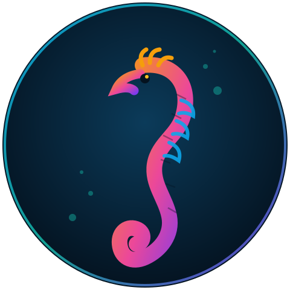
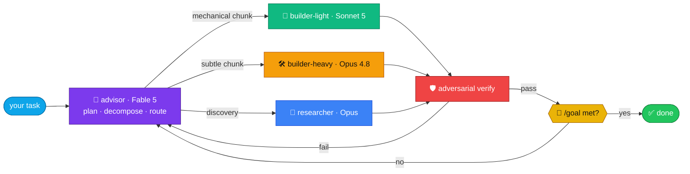
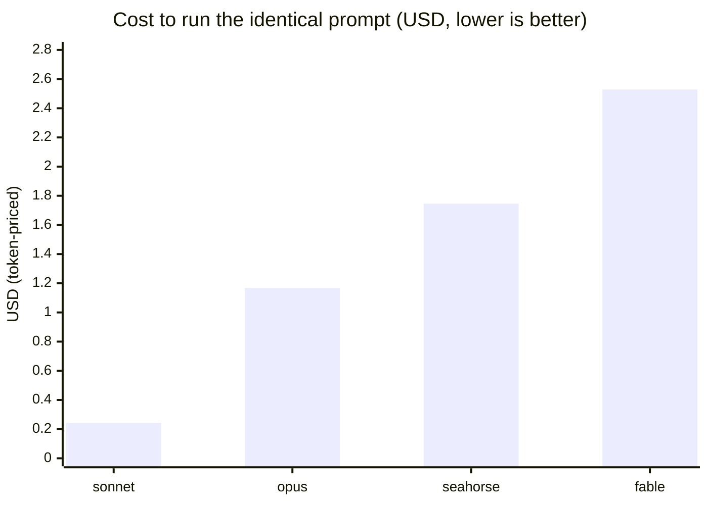
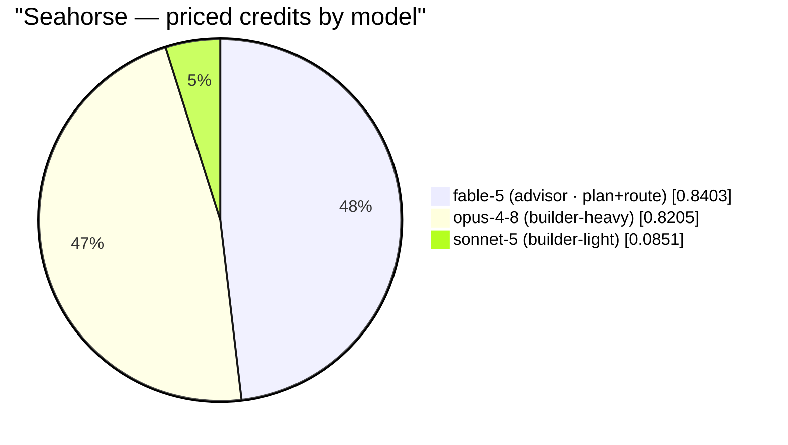

<div align="center">



```
                     ___
                   ,'   `.
                  /  (o)   \
                 |   .--.   |
              .--'  (    )   `.
             /   .   `--'      \
             \    `.         _.-'
              `.    `-._  ,-'
                `.      `|
                  \      |
                   |     |
                   |     |
                   |    /
                    \  |
                 ,--.`. `.
                /    \ `. `.
                \     \  `. |
                 `.    |   `|
                   `.  |    '
                     `.|   .'
                       `--'
```

# 🐚 Seahorse

### the model-routing orchestration layer for Claude Code

*One architect model plans. Cheaper specialists build. An adversary verifies.*
*Every unit of work is routed to the model that does it best — under a token diet,*
*over a live knowledge graph, with typeset output.*

</div>

---

## Where Seahorse sits in the world of AI engineering

Modern AI engineering is a stack of layers. Seahorse is not another model, not another
agent framework, and not an app — it is the **routing / orchestration layer** that sits
*between* the agent runtime and the frontier models, deciding **which model does which
piece of work**.

```
┌──────────────────────────────────────────────────────────────────────┐
│  APPLICATION            your task: "fix this bug", "write this doc"    │
├──────────────────────────────────────────────────────────────────────┤
│  AGENT RUNTIME          Claude Code — tools, files, shell, MCP, hooks  │
├──────────────────────────────────────────────────────────────────────┤
│ ▶ ORCHESTRATION LAYER   ★ SEAHORSE ★                                   │
│   (advisor → executor)  plan · decompose · route-per-chunk · verify ·  │
│                         hold-goal-across-turns · price-per-token       │
├──────────────────────────────────────────────────────────────────────┤
│  FRONTIER MODELS        Fable 5 · Opus 4.8 · Sonnet 5 · Haiku · GPT    │
├──────────────────────────────────────────────────────────────────────┤
│  INFERENCE / SERVING    the Claude & Codex APIs                        │
└──────────────────────────────────────────────────────────────────────┘
```

The problem Seahorse exists to solve: **a single model at a single price does every
part of a task.** You pay top-tier rates to rename a variable and planner-tier rates to
type out boilerplate. Frontier models are not interchangeable — a planner reasons,
a heavy builder handles subtlety, a light builder grinds mechanical edits — but the
default agent loop treats them as one.

Seahorse is the layer that **breaks the task apart and assigns each fragment to the
right tier.** In the language of the field, it is a **cost-aware model-routing meta-agent**:
a thin planning-and-dispatch layer that turns *one big expensive call* into *a plan plus
several cheap, verified, tier-matched calls* — and measures, in tokens converted to
dollars, whether that trade actually paid off.

> **Seahorse** is the whole framework this repo installs.
> The token-discipline sublayer ships vendored in `vendor/` — **caveman** (talk less) +
> **ponytail** (write less code) — so tokens are spent on substance, not ceremony.

---

## The core idea in one picture



**The advisor never touches code.** It reads just enough to plan, splits the task into
independently verifiable chunks, and stamps each chunk with a model tier. Executors build
and self-check; an adversarial pass tries to break the result before it counts as done;
`/goal` holds the end-state across turns until it's actually met.

Full flow diagrams, the per-session lifecycle, and the complete routing table live in
[`docs/architecture.md`](docs/architecture.md).

### The routing table (who does what, and why)

| Role | Model | When it's picked |
|------|-------|------------------|
| 🧭 **Advisor / architect** | Fable 5 → Opus 4.8 (1M) when hard | always enters first; plans + routes, writes no code |
| 🔧 **Builder-light** | Sonnet 5 | mechanical, well-scoped, high-volume edits |
| 🛠️ **Builder-heavy** | Opus 4.8 (1M) | ambiguous, cross-cutting, subtle work |
| 🔬 **Researcher** | Opus 4.8 (1M) | discovery / literature, primary-source + cited |
| 🧪 **Verifier** | GPT (Codex) → Opus skeptic fallback | second opinion, adversarial review |
| 🎯 **Goal evaluator** | Haiku | cheap "is the condition met yet?" checks |

The routing thesis: **don't pay the top tier for the easy 80%.** Reserve Opus for the
subtle 20%, grind the rest on Sonnet, and let a cheap planner decide the split.

---

## What it wires together

| Concern | Tooling |
|---------|---------|
| Talk less / write less code | [caveman](https://github.com/JuliusBrussee/caveman) + [ponytail](https://github.com/DietrichGebert/ponytail) (vendored, MIT) |
| Plan → delegate → verify | **Fable** advisor → **Sonnet/Opus** executors → **GPT** (Codex) review |
| Research | `/research`, `/deep-research`, dynamic Workflows, arXiv (alphaXiv MCP), primary sources |
| Knowledge graph | [graphify](https://github.com/safishamsi/graphify) → [OKF](https://github.com/GoogleCloudPlatform/knowledge-catalog/blob/main/okf/SPEC.md) |
| Hold work across turns | `/goal`, `/workflows` |
| Outputs | PDFs = **LaTeX/tectonic**, diagrams = **Mermaid** |
| CI/CD | GitHub Actions templates (lint → type → test → build) |

---

## Install

Seahorse ships **two ways**, because Claude Code has two extension models.

### A. As a plugin (shareable, versioned) — skills namespaced `/seahorse:seahorse`

```bash
claude plugin marketplace add Archit3115/seahorse
claude plugin install seahorse@seahorse
# optional companion token-discipline plugins (vendored in this repo):
claude plugin install caveman@seahorse ponytail@seahorse
```

Or ask Claude to do it for you after cloning — those are the two commands it runs.

**Auto-install on clone:** this repo carries a `.claude/settings.json` that pre-registers
the marketplace and enables the plugins. When you open Claude Code **inside the cloned repo**
and trust the folder, Claude Code can offer to install them without you typing the commands.
This only affects sessions started in this directory, and — being third-party code — it still
asks for your consent. There is **no** silent install-on-`git clone`; that would be a security
hole, and Claude Code does not do it. If your version doesn't prompt, run the two commands above.

Local dev without installing: `claude --plugin-dir /path/to/seahorse`.

### B. As standalone `~/.claude` config — gives you the **bare** `/seahorse` command

```bash
./install.sh
```

It merges (never clobbers) your global `CLAUDE.md`, installs the four agents and four commands
(including the bare `/seahorse`), and wires the SessionStart bootstrap hook. Optional tooling it
points you at: `tectonic` (LaTeX PDFs), `uv` + `graphifyy` (knowledge graph), `codex` CLI +
`codex login` (GPT review).

**Which to pick:** plugin for a clean, versioned, shareable install; installer if you specifically
want the bare `/seahorse` and the global contract. They coexist — a `--plugin-dir` copy wins for
its session. A project's own `.claude/CLAUDE.md` always overrides Seahorse.

---

## How a task flows

1. `/seahorse <task>` → the **advisor** (Fable) returns a chunk→model table + a `/goal` condition.
2. You approve → each chunk goes to its executor (`builder-light`=Sonnet, `builder-heavy`=Opus,
   `/codex:*`=GPT), verified adversarially.
3. `/goal` holds the end-state across turns; `/workflows` runs deterministic fan-outs.
4. Research → `/research` / `/deep-research` (Opus, primary sources, cited).
5. Docs → `/pdf` (LaTeX/tectonic); diagrams → Mermaid; `/kg` keeps the knowledge graph fresh.

---

## Does the routing actually pay off? — the credit benchmark

A routing layer only earns its keep if you can **measure** the trade. Seahorse ships a harness
([`benchmarks/`](benchmarks/)) that runs the **same prompt** through four conditions — **Fable
solo**, **Opus solo**, **Sonnet solo**, and **Seahorse orchestration** — reads the CLI's
per-model `modelUsage`, and **prices every model's tokens into equivalent USD** from a published
rate card, cross-checked against the CLI's own billed figure. Because `modelUsage` rolls up
*subagent* tokens, a Seahorse run shows the advisor's Fable tokens **and** every builder
subagent's tokens — the classic "subagent cost hides from the top-level meter" gap is closed.

### Live run — "Build a Netflix-style portfolio site" (2026-07-22)

The exact prompt, byte-identical across all four conditions:

> *Build a portfolio website for Archit Srivastava(me) and the style needs to be as netflix.*

**Credits per model, converted to USD** (one `claude -p` run per condition, **$5.51 billed total**):

| condition | models that spent credits | total tokens | **cost (USD)** | built a working site? |
|-----------|---------------------------|-------------:|---------------:|:---------------------:|
| **sonnet**   | sonnet-5                              |  73,554 | **$0.24** | ✗ answered as chat |
| **opus**     | opus-4-8                              | 367,049 | **$1.17** | ✓ 837-line `index.html` |
| **seahorse** | **fable-5 + opus-4-8 + sonnet-5**     | 416,668 | **$1.57** billed / $1.75 priced | ✓ 479-line `index.html` |
| **fable**    | fable-5                              | 317,507 | **$2.53** | ✗ printed code, wrote no file |

<sub>USD = tokens × public rate card (fable $10/$50 · opus $5/$25 · sonnet $3/$15 · haiku $1/$5 per MTok,
cache read 0.1×, cache write 2×), reproducing the CLI's billed cost to the cent for solo runs. A tiny
`haiku` utility-model charge (~$0.0006) is folded into each row.</sub>



Seahorse's credits **split across the three models it actually orchestrated** — the routing made
visible (priced components sum to $1.75; the CLI billed $1.57):



**Honest read:**

- **Seahorse genuinely orchestrated three tiers.** The Fable advisor planned and routed, then spent
  real credits on **both** an Opus heavy-builder (the bulk of the HTML) and a Sonnet light-builder
  (the mechanical bits) — all three captured in the priced total. It shipped a working Netflix-style
  site and cost **less than solo-Fable**.
- **On a single small task, solo-Opus is the cost-effective pick** ($1.17 vs Seahorse's $1.57). The
  advisor + delegation overhead only amortizes on **long, mixed-difficulty** work where the honest
  baseline is solo-Opus and there's a big mechanical bulk to offload to Sonnet. One landing page
  isn't that — this run **bounds where orchestration helps** rather than proving it always does.
- **Fable solo is the anti-pattern the router removes** — the planner tier ($10/$50 per MTok) run as
  a coder was the **most expensive ($2.53)** and printed the site as text without writing a file.
- **Sonnet solo was cheapest ($0.24) but shipped nothing** — it read the vague one-liner as a chat.

Full per-model token breakdown, methodology, and limitations:
[`benchmarks/results/PORTFOLIO_NETFLIX.md`](benchmarks/results/PORTFOLIO_NETFLIX.md). The built
artifacts are saved under
[`benchmarks/results/local/artifacts/`](benchmarks/results/local/artifacts/). Reproduce:

```bash
cd benchmarks
IS_SANDBOX=1 python3 run_local.py --tasks portfolio-netflix \
  --conditions sonnet,fable,opus,seahorse --max-usd 25
python3 score_local.py
```

> An earlier two-task pilot (palindrome + todo-cli) is preserved in
> [`benchmarks/results/RESULTS.md`](benchmarks/results/RESULTS.md); the SWE-bench **accuracy** track
> (does routing resolve *more* issues) needs Docker — see [`benchmarks/results/PILOT.md`](benchmarks/results/PILOT.md).

---

## Layout

```
seahorse/
├── .claude-plugin/
│   ├── plugin.json                # plugin manifest (the seahorse plugin)
│   └── marketplace.json           # marketplace: seahorse + vendored caveman + ponytail
├── .claude/settings.json          # auto-install pre-config (trust-prompt, this dir only)
├── commands/                      # /seahorse · /research · /kg · /pdf
├── agents/                        # advisor · researcher · builder-heavy · builder-light
├── hooks/                         # SessionStart contract-injection + bootstrap
├── contract/                      # global + per-project CLAUDE.md, settings snippet
├── vendor/                        # caveman + ponytail forks (MIT, attribution preserved)
├── benchmarks/                    # the credit benchmark: Fable vs Opus vs Sonnet vs Seahorse
├── docs/
│   ├── architecture.md            # Mermaid diagrams + routing table
│   └── assets/seahorse.svg        # the seahorse mark
├── templates/ci/                  # node.yml · python.yml
└── install.sh                     # standalone ~/.claude installer
```

---

## License

MIT — see [LICENSE](LICENSE). Vendored `caveman` and `ponytail` retain their own MIT licenses under
`vendor/*/LICENSE`.
