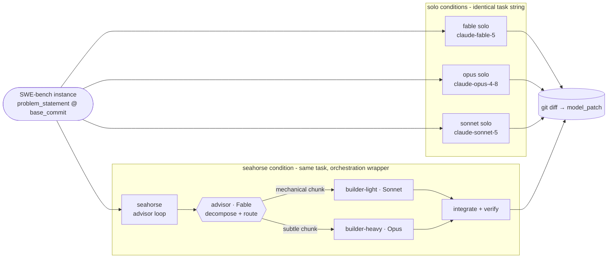
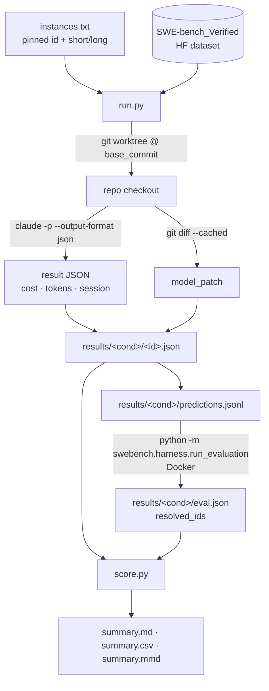
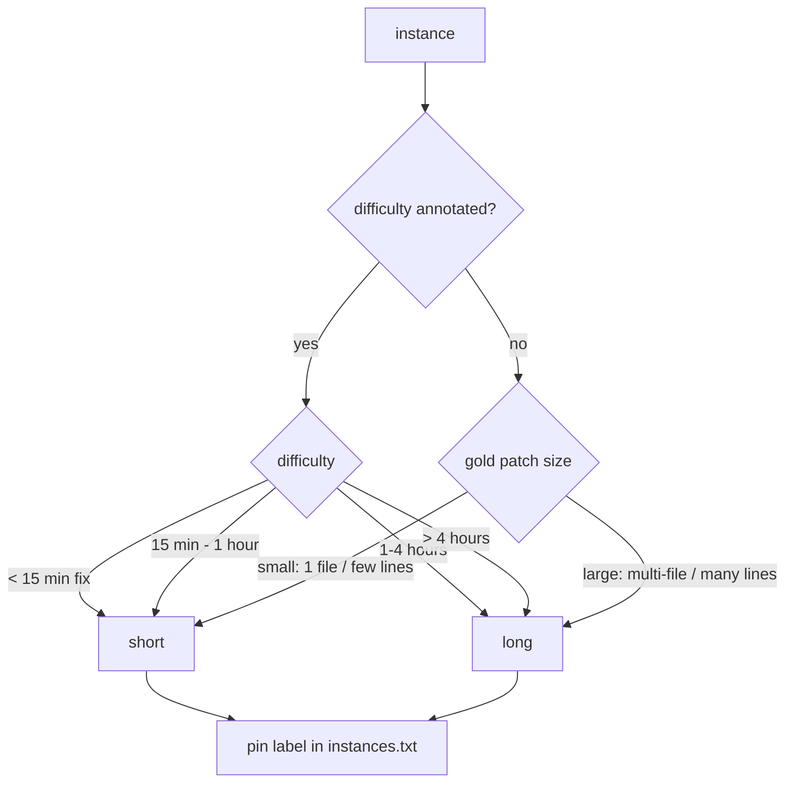
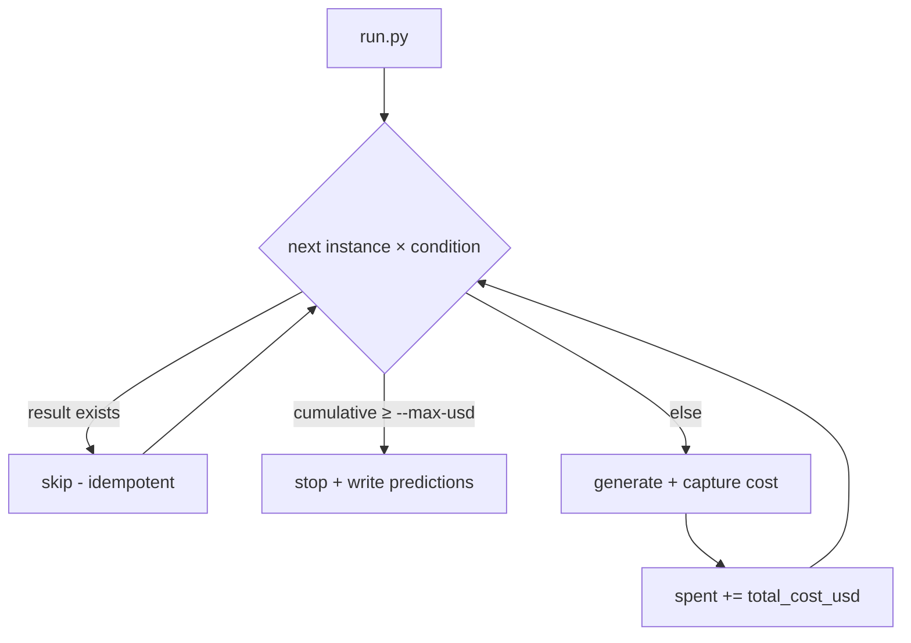
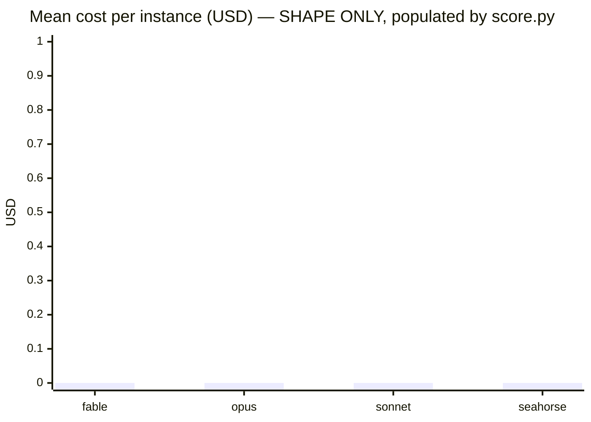

# Seahorse benchmark — diagrams

All diagrams are **design/architecture** (Mermaid). Any diagram showing measured *numbers* is
generated by `score.py` from real run data (`results/summary.mmd`) — none are hand-drawn, so the
repo never ships fabricated results.

## 1. The four conditions



## 2. Generation → eval → score pipeline



## 3. Metric capture per run

```mermaid
sequenceDiagram
    participant Run as run.py
    participant Git as git worktree
    participant CC as claude -p (headless)
    Run->>Git: worktree add --detach @ base_commit
    Run->>Run: t0 = monotonic()
    Run->>CC: prompt + --model + --output-format json
    CC-->>Run: {total_cost_usd, usage.*, session_id, result}
    Run->>Run: wall_ms = monotonic() - t0
    Run->>Git: add -A ; diff --cached  → model_patch
    Run->>Run: write results/<cond>/<id>.json
    Run->>Git: worktree remove --force
```

## 4. Stratification decision



## 5. Cost-cap control flow



## 6. Results chart (generated, not hand-drawn)

`score.py` writes `results/summary.mmd` — a Mermaid `xychart-beta` of mean cost per condition,
built **only** from real captured runs. Until a run exists it is intentionally absent. Example of
the *shape* it produces (values are placeholders, not measurements):


