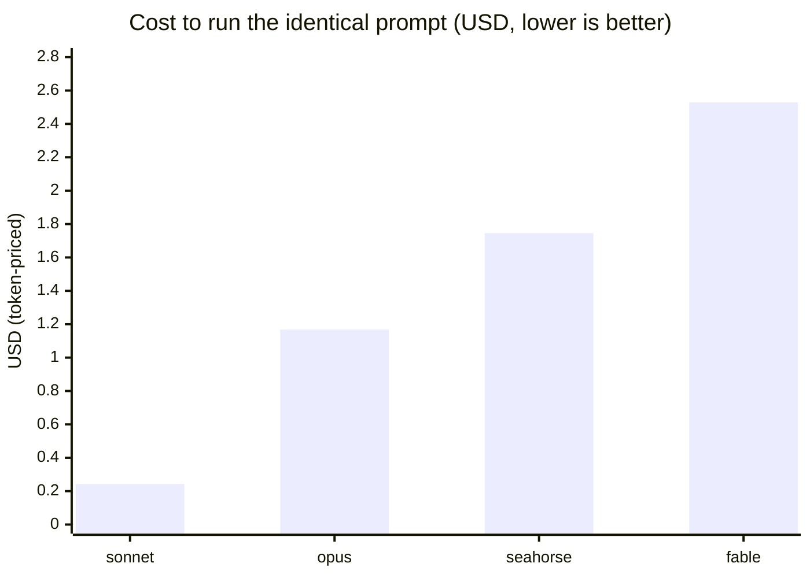
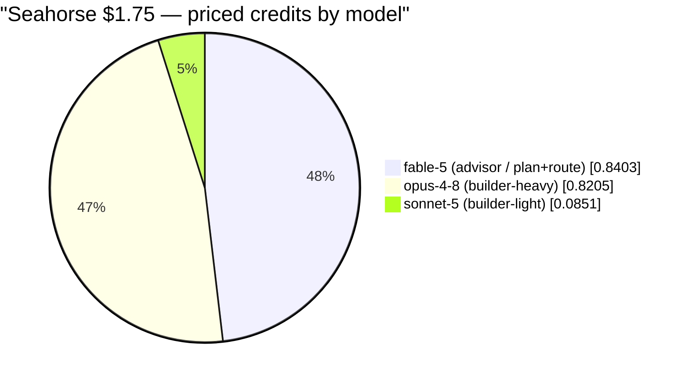

# Single-prompt benchmark — "Netflix-style portfolio site"

**Run date:** 2026-07-22 · **Track:** local token-priced (no Docker) · **Conditions:** 4 ·
**Runs:** 4 real `claude -p` invocations · **Total billed:** **$5.51**.

One creative, deliberately under-specified prompt run **byte-identical** across the four conditions,
scored on **credits (tokens) per model → equivalent USD** via the published rate card
([`pricing.py`](../pricing.py)), cross-checked against the CLI's own `total_cost_usd`. Reproduce:

```bash
IS_SANDBOX=1 python3 run_local.py --tasks portfolio-netflix \
  --conditions sonnet,fable,opus,seahorse --max-usd 25
```

> `IS_SANDBOX=1` is only needed when the host runs `claude` as root (CI containers); it lets
> `--dangerously-skip-permissions` proceed. The guarded denylist still applies.

## The prompt (identical for all four)

> Build a portfolio website for Archit Srivastava(me) and the style needs to be as netflix.

Nothing was added for any condition. The seahorse condition wraps this exact string in the generic
advisor-loop trigger ([`seahorse_prompt.md`](../seahorse_prompt.md)) — orchestration instructions only,
no problem-specific hints (the fairness contract).

## Results — credits per model, priced to USD

| condition | entry model | turns | wall | models that spent credits | total tokens | **priced USD** | billed USD | built `index.html`? |
|-----------|-------------|------:|-----:|---------------------------|-------------:|---------------:|-----------:|:-------------------:|
| **sonnet**   | sonnet-5 | 2  | 19.6s  | sonnet-5 (+ haiku router)                 |  73,554 | **$0.2428** | $0.2428 | ✗ (answered as chat) |
| **opus**     | opus-4-8 | 10 | 251.1s | opus-4-8 (+ haiku router)                 | 367,049 | **$1.1679** | $1.1679 | ✓ 837 lines |
| **seahorse** | fable-5 (advisor) | 9 | 282.8s | **fable-5 + opus-4-8 + sonnet-5** (+ haiku) | 416,668 | **$1.7459** | $1.5706 | ✓ 479 lines |
| **fable**    | fable-5  | 9  | 276.7s | fable-5 (+ haiku router)                  | 317,507 | **$2.5290** | $2.5290 | ✗ (emitted code as text) |

<sub>`haiku-4-5` appears in every run as Claude Code's internal utility model (~$0.0006 each) — routing /
housekeeping, not the task model. It is included in the totals for honesty.</sub>

### Where each dollar went — per-model token → USD breakdown

| condition | model | input | output | cache read | cache write | priced USD |
|-----------|-------|------:|-------:|-----------:|------------:|-----------:|
| sonnet   | sonnet-5 | 4  | 890    | 35,748  | 36,357 | $0.2422 |
| opus     | opus-4-8 | 16 | 21,034 | 296,112 | 49,332 | $1.1673 |
| seahorse | fable-5 *(advisor)*        | 16 | 4,939  | 251,606 | 17,081 | $0.8403 |
| seahorse | opus-4-8 *(builder-heavy)* | 12 | 15,583 | 48,750  | 40,647 | $0.8205 |
| seahorse | sonnet-5 *(builder-light)*| 8  | 1,065  | 26,780  | 10,181 | $0.0851 |
| fable    | fable-5  | 13 | 23,474 | 237,617 | 55,848 | $2.5284 |

Rate card (first-party Claude API, standard tier, $/MTok — base input / output):
**fable-5 $10/$50 · opus-4-8 $5/$25 · sonnet-5 $3/$15 · haiku-4-5 $1/$5.** Cache read = 0.1× base,
cache write (1h TTL) = 2× base.



Seahorse's dollar split across its three models — the orchestration made visible:



## What the numbers say — honest read

1. **Only Opus and Seahorse shipped a working file.** Both wrote a real, standalone `index.html`
   (opus 837 lines / 38 KB, seahorse 479 lines / 20 KB) — Netflix-style hero, row rails, card hovers,
   titled for Archit Srivastava. Both artifacts are saved under
   [`results/local/artifacts/portfolio-netflix/`](local/artifacts/portfolio-netflix/).
2. **Cheapest working build = Opus solo, $1.17.** On a *single* self-contained creative task, a lone
   Opus is the cost-effective pick — consistent with the earlier pilot: the advisor + delegation
   overhead of orchestration doesn't amortize on one task with no big mechanical bulk to offload.
3. **Seahorse actually orchestrated — and the credits prove it.** The Fable advisor planned and routed,
   then spent real tokens on **both** an Opus `builder-heavy` and a Sonnet `builder-light`. All three
   models show up in the priced total (subagent rollup via `modelUsage`), and each did tier-appropriate
   work — Opus the heavy build (15.6 K output), Sonnet the light bits (1.1 K output). It cost $1.75
   priced / $1.57 billed: more than solo-Opus here, less than solo-Fable.
4. **Fable solo is the wrong tool and the most expensive ($2.53).** Fable is the *planner* tier
   ($10/$50 per MTok). Run as a solo coder it ran 9 turns, emitted ~23 K output tokens — but printed
   the site as text in its reply instead of writing a file, so nothing landed on disk. Paying planner
   rates to *type out* HTML is exactly the anti-pattern Seahorse routes around.
5. **Sonnet solo was cheapest ($0.24) but didn't build.** Given the vague one-liner it answered
   conversationally in 2 turns (890 output tokens, no file). Cheap, but no deliverable — the flip side
   of Fable's over-spend.
6. **The token → USD conversion is trustworthy.** priced == billed **to the cent** for all three solo
   runs. Seahorse priced is ~11% above billed — the rate card prices every subagent's cache-write at
   the 1h TTL; a subagent that opened a 5m cache is over-priced slightly, and seahorse has the most
   subagents, so its residual is the largest.

## Limitations

- **n = 1 per condition.** One creative prompt, one sample each — a screening design, not a significance
  test. Whether a model *writes a file* vs *prints code* for a vague ask is partly sampling luck; re-runs
  will vary. Treat these as order-of-magnitude and as a demonstration of the **accounting**, not a verdict
  on model quality.
- **No quality/aesthetics score.** "Built a file that says Netflix" is the only automated proxy; nobody
  graded the two sites for design. Cost is measured; taste is not.
- **This is a cost benchmark, not an accuracy benchmark.** For resolved-rate on real issues see the
  SWE-bench track ([`run.py`](../run.py)) and [`PILOT.md`](PILOT.md).
- **Single-task regime favors solo models.** Seahorse's thesis ("don't pay the top tier for the easy
  80%") only cashes out on long, mixed-difficulty work where solo-Opus is the honest baseline. One
  landing page isn't that; it bounds where orchestration helps rather than proving it does.
