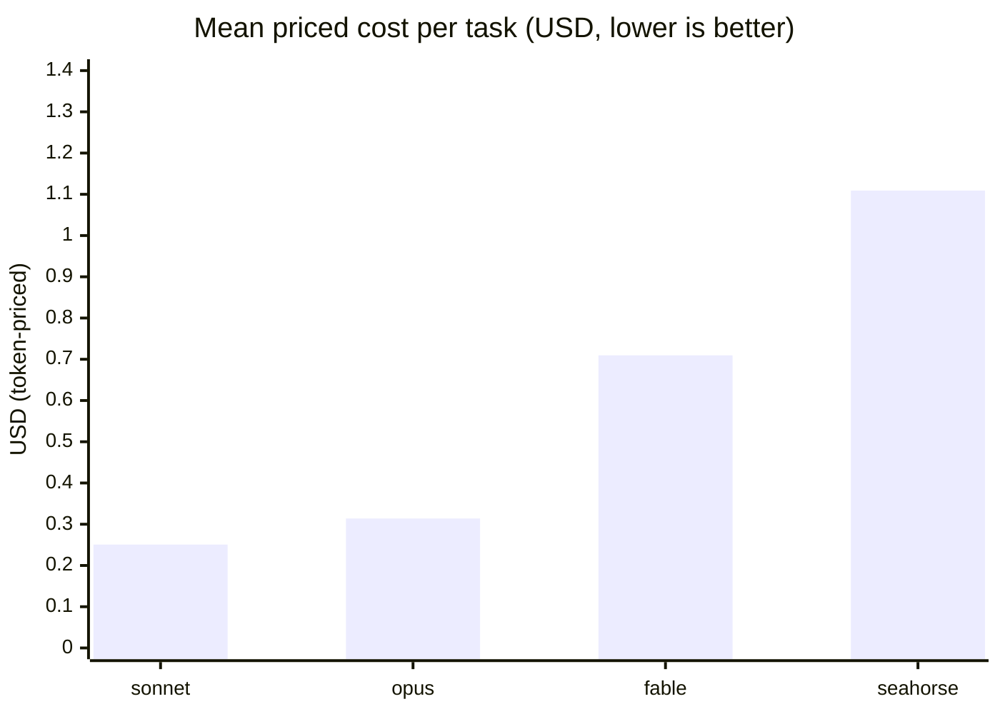
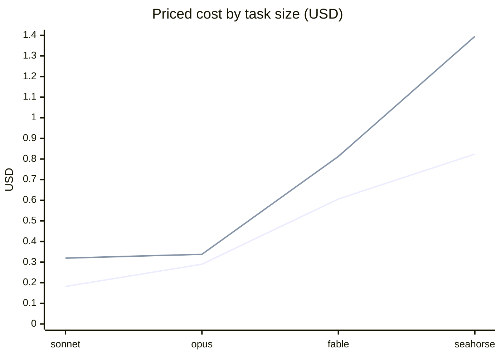

# Seahorse token-cost benchmark — measured results

**Run date:** 2026-07-05 · **Track:** local token-priced (no Docker) · **Tasks:** 2 self-contained
coding tasks (1 short, 1 long) × 4 conditions = **8 real `claude -p` runs** · **Total billed:** $4.69.

Metric = **tokens converted to equivalent USD** via a published rate card ([`pricing.py`](../pricing.py)),
cross-checked against the CLI's own `total_cost_usd`. Both numbers roll up **subagent** tokens through
the CLI's `modelUsage` map, so the seahorse rows include its Sonnet builder's tokens — not just the
Fable advisor's. Reproduce: `python3 run_local.py --max-usd 10 && python3 score_local.py`.

## The tasks

| id | stratum | ask | correctness check |
|----|---------|-----|-------------------|
| `palindrome` | short | one function `is_palindrome`, alnum-only, with a `demo()` self-check | `python3 palindrome.py` exits 0 |
| `todo-cli`   | long  | argparse todo app (add/list/done/rm) persisting JSON + a full `test_todo.py` | `python3 test_todo.py` exits 0 |

Identical task string across all 4 conditions; the seahorse condition adds only the generic advisor-loop
wrapper ([`seahorse_prompt.md`](../seahorse_prompt.md)). **All 8 runs passed their correctness check (100%).**

## Results

| condition | stratum | check | priced $ | billed $ | tokens | wall | models used |
|-----------|---------|:-----:|---------:|---------:|-------:|-----:|-------------|
| fable    | short | 100% | $0.6062 | $0.6062 | 103,699 | 20.7s | fable-5 |
| fable    | long  | 100% | $0.8127 | $0.8127 | 112,947 | 51.2s | fable-5 |
| opus     | short | 100% | $0.2899 | $0.2899 | 100,162 | 14.4s | opus-4-8 |
| opus     | long  | 100% | $0.3378 | $0.3378 | 104,175 | 39.3s | opus-4-8 |
| sonnet   | short | 100% | $0.1819 | $0.1819 | 135,930 | 15.1s | sonnet-5 |
| sonnet   | long  | 100% | $0.3194 | $0.3194 | 342,292 | 49.8s | sonnet-5 |
| seahorse | short | 100% | $0.8237 | $0.7911 | 154,482 | 61.8s | fable-5 + sonnet-5 |
| seahorse | long  | 100% | $1.3946 | $1.3526 | 375,657 | 106.8s | fable-5 + sonnet-5 |

Mean priced cost per task (lower is better):

Cost vs. wall-clock, short vs. long:

lower line = short task · upper line = long task

## What the numbers say

1. **The rate card reproduces billed cost.** priced == billed to the cent for every solo run
   (fable/opus/sonnet), and within ~4% for seahorse (the residual is the cache-write-duration
   approximation on the Sonnet subagent). The token→money conversion is trustworthy.
2. **Subagent rollup works.** Both seahorse rows show `fable-5 + sonnet-5`: the Fable advisor delegated
   to a Sonnet `builder-light`, and both models' tokens landed in the priced total. The headline problem
   with token accounting (subagent tokens hiding from the top-level `usage`) is solved by reading
   `modelUsage` instead.
3. **On these tasks, orchestration loses — and that's the honest finding.** Ranked by mean priced cost:
   **sonnet $0.25 < opus $0.31 < fable $0.71 < seahorse $1.11.** Seahorse is the *most* expensive on both
   the short *and* long task, and the slowest (2–3× the wall-clock).
4. **Fable-solo is expensive** ($0.71) — expected: Fable is a planner tier ($10/$50 per MTok), wasteful as
   a solo coder. It's a baseline, not a recommendation.

## Why seahorse costs more here (and where it should win)

The pilot tasks are **small and unambiguous** — exactly the regime where orchestration can't pay off:

- The Fable advisor ($10/$50 per MTok) must read the task, plan, and hand off *before any code exists* —
  fixed overhead that a one-shot Sonnet pass skips entirely.
- Delegation re-establishes context in a fresh subagent (more input tokens), then the advisor re-reads the
  result to integrate. On a 15-line palindrome function that overhead **is** the cost.
- With only easy chunks, there's nothing to route to the expensive tier — so seahorse pays planning +
  delegation overhead for a result a lone Sonnet produces for $0.18.

Seahorse's thesis is **"don't pay Opus rates for the easy 80%."** That only cashes out when the honest
solo baseline is **Opus on a large, mixed-difficulty task** — where routing the mechanical 80% to Sonnet
saves more than the advisor+delegation overhead costs. None of the pilot tasks are big or heterogeneous
enough to trigger that. **This benchmark therefore bounds where Seahorse helps rather than proving it
does:** on short/simple work, use a single cheap model; reserve orchestration for long, mixed tasks.

## Honest limitations

- **n = 1 per cell.** Two tasks, one sample each — a screening design, not a significance test. LLM
  sampling is noisy; treat these as order-of-magnitude, not ±.
- **No accuracy separation.** Both tasks were easy enough that every condition passed, so this run measures
  *cost*, not *quality*. The quality question needs the SWE-bench track ([`run.py`](../run.py)) with the
  official Docker eval — which this host can't run (see [`PILOT.md`](PILOT.md)).
- **The decisive test is missing on purpose.** A fair test of the routing thesis needs long,
  mixed-difficulty tasks with **solo-Opus** as the baseline. That's the next run to fund, not toy tasks
  where solo-Sonnet already wins.
- **Cache-duration approximation.** The rate card prices cache-creation at the 1h TTL (what Claude Code
  uses for its system/tools prefix, verified against a live probe). A subagent that writes a 5m cache is
  over-priced slightly — the source of the ~4% seahorse priced-vs-billed gap.
