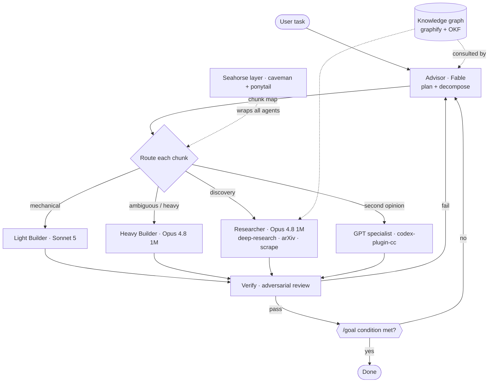
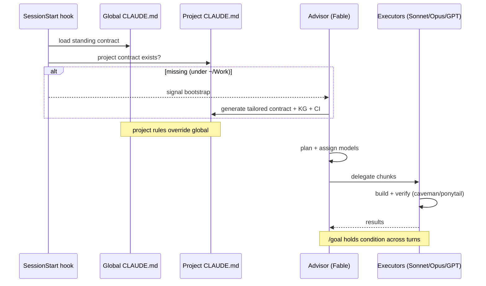

# Seahorse Architecture

Seahorse is an **LLM web framework** for Claude Code: a thin orchestration layer that routes each unit of
work to the model that does it best, keeps a project knowledge graph, researches from primary sources,
typesets output, and speaks in as few tokens as the task allows.

## Advisor → Executor flow

## Per-session lifecycle

## Components

| Layer | Tool | Role |
|-------|------|------|
| Token discipline | **caveman** + **ponytail** (= *seahorse*) | talk less, write less code |
| Advisor | **Fable 5** (→ Opus 4.8 1M) | plan + decompose + assign models |
| Executors | **Sonnet 5** / **Opus 4.8 1M** | light / heavy build + research |
| GPT bridge | **codex-plugin-cc** | second opinion, adversarial review, rescue |
| Research | **/deep-research**, Workflows, alphaXiv MCP | primary-source, cited, verified |
| Knowledge | **graphify** + **OKF** | persistent project knowledge graph |
| Control flow | **/goal**, **/workflows** | hold conditions, deterministic fan-out |
| Outputs | **tectonic** (LaTeX), **Mermaid** | typeset PDFs + diagrams |
| CI/CD | GitHub Actions templates | lint → type → test → build |

## Model-routing table

| Role | Model | Effort | Mechanism |
|------|-------|--------|-----------|
| Advisor / architect | Fable 5 → Opus 4.8 1M | low/med · high/xhigh when hard | `advisor` agent, `/plan` |
| Researcher | Opus 4.8 1M | high | `researcher` agent, `/deep-research` |
| Heavy builder | Opus 4.8 1M | med/high | `builder-heavy` agent |
| Light builder | Sonnet 5 | low/med | `builder-light` agent |
| GPT specialist | GPT/Codex | — | `/codex:*` |
| Goal evaluator | Haiku | — | `/goal` (built-in) |

**Honest limitation:** a running session can't silently change its own model. Routing is realized by
spawning subagents / Workflow stages with explicit `model` overrides, or by the user running `/model`.
1M-context is primarily the main session's tier; subagents run standard Opus/Sonnet/Fable.
