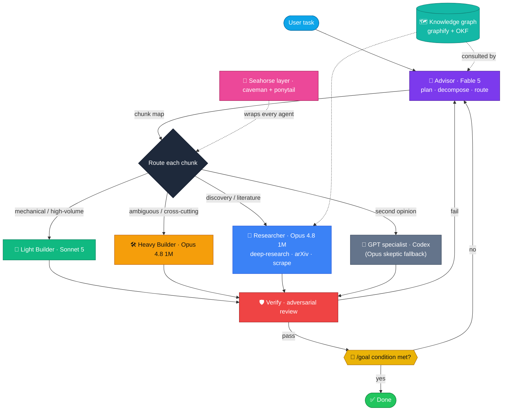
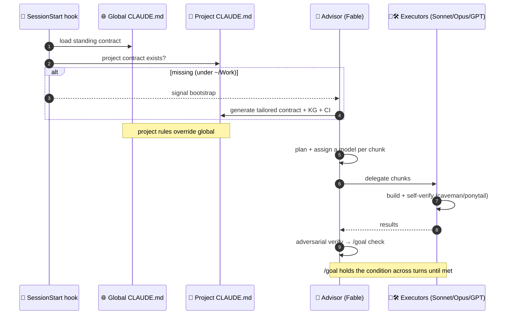
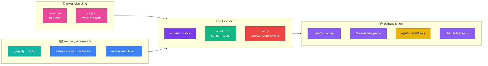
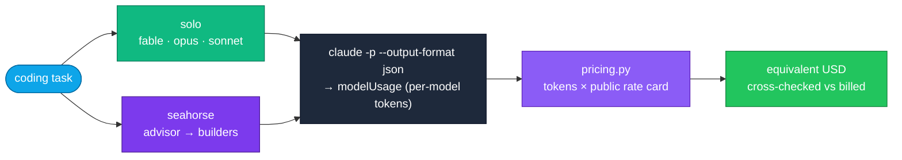

# Seahorse Architecture

Seahorse is an **advisor→executor orchestration layer for Claude Code**. Instead of one model doing
everything at one price, Seahorse sends each unit of work to the model that does it best: a cheap
architect *plans*, cheap specialists *build*, an adversarial pass *verifies*, and the whole thing runs
under a strict token diet, over a live project knowledge graph, emitting typeset output.

> One sentence: **Fable plans, Sonnet/Opus build, GPT/Opus reviews — routed per chunk, priced per token.**

---

## What it is intended to do

| Goal | How Seahorse gets there |
|------|--------------------------|
| **Spend less per task** | Route trivial/mechanical chunks to the cheapest capable model (Sonnet) and reserve Opus for the subtle 20%. Don't pay Opus rates to rename a variable. |
| **Plan before building** | A dedicated **advisor** (Fable) decomposes the task and assigns each chunk a model *before* any code is written — planning is separated from doing. |
| **Be right, not just fast** | Every non-trivial result passes an **adversarial verify** (GPT via Codex, or an Opus skeptic when Codex is unauthenticated) before it counts as done. |
| **Remember the project** | A persistent **knowledge graph** (graphify → OKF) lets agents reason over structure instead of re-grepping every session. |
| **Research from sources** | Discovery is routed to Opus with primary-source tools (arXiv via alphaXiv, web scrape), adversarially verified and cited — not recalled from memory. |
| **Hold work across turns** | `/goal` pins a verifiable end-state; `/workflows` fans work out deterministically; `/autoresearch` refines one metric via keep-or-revert loops. |
| **Ship, not just draft** | PDFs are real LaTeX (tectonic), diagrams are Mermaid, and every shipping project gets a CI pipeline. |
| **Talk less, write less code** | The **caveman** (terse prose) + **ponytail** (minimal code) layer wraps every agent, so tokens go to substance. |

The **harness** is the measurement half of the same idea: it runs real coding tasks under each model —
solo vs. orchestrated — captures per-model token usage, and prices those tokens into equivalent dollars,
so the routing claim above is checked against numbers rather than asserted. See
[the benchmark](../benchmarks/README.md).

---

## The big picture

**Colour legend** — 🟣 advisor (plans) · 🟢 light builder (cheap/mechanical) · 🟠 heavy builder (subtle) ·
🔵 researcher · ⚪ GPT specialist · 🔴 verify · 🟡 goal gate · 🩷 token-discipline layer · 🩵 knowledge graph.

---

## Per-session lifecycle

---

## How the pieces fit

---

## Components

| Layer | Tool | Role |
|-------|------|------|
| Token discipline | **caveman** + **ponytail** (= *seahorse*) | talk less, write less code |
| Advisor | **Fable 5** (→ Opus 4.8 1M) | plan + decompose + assign models |
| Executors | **Sonnet 5** / **Opus 4.8 1M** | light / heavy build + research |
| GPT bridge | **codex-plugin-cc** | second opinion, adversarial review, rescue |
| Research | **/deep-research**, Workflows, alphaXiv MCP | primary-source, cited, verified |
| Knowledge | **graphify** + **OKF** | persistent project knowledge graph |
| Control flow | **/goal**, **/workflows**, **/autoresearch** | hold conditions, fan-out, refine-to-metric |
| Outputs | **tectonic** (LaTeX), **Mermaid** | typeset PDFs + diagrams |
| CI/CD | GitHub Actions templates | lint → type → test → build |

## Model-routing table

| Role | Model | Effort | Mechanism |
|------|-------|--------|-----------|
| Advisor / architect | Fable 5 → Opus 4.8 1M | low/med · high/xhigh when hard | `advisor` agent, `/seahorse` |
| Researcher | Opus 4.8 1M | high | `researcher` agent, `/deep-research` |
| Heavy builder | Opus 4.8 1M | med/high | `builder-heavy` agent |
| Light builder | Sonnet 5 | low/med | `builder-light` agent |
| GPT specialist | GPT/Codex | — | `/codex:*` |
| Goal evaluator | Haiku | — | `/goal` (built-in) |

**Honest limitation:** a running session can't silently change its own model. Routing is realized by
spawning subagents / Workflow stages with explicit `model` overrides, or by the user running `/model`.
1M-context is primarily the main session's tier; subagents run standard Opus/Sonnet/Fable.

---

## The benchmark harness — measuring the claim

Seahorse ships its own harness so the "route to save money" claim is *measured*, not asserted. Two tracks:

- **Token-priced track** ([`run_local.py`](../benchmarks/run_local.py)) — no Docker. Runs self-contained
  coding tasks, reads the CLI's `modelUsage` (which rolls up *subagent* tokens, so the seahorse advisor's
  Sonnet/Opus builders are counted), and prices tokens via a published rate card. **Cost is converted from
  tokens**, then cross-checked against the CLI's own billed figure. This is the "no real-money meter" path.
- **SWE-bench track** ([`run.py`](../benchmarks/run.py)) — the heavyweight accuracy path (Docker + official
  swebench eval) for resolved-rate on real GitHub issues.

Both runs headless. Because a headless agent can't answer permission prompts, the local runner uses a
**guarded** mode: `--dangerously-skip-permissions` for auto-approval, but with a hard denylist
(`rm`, `mv`, `curl`, `wget`, `git`, `sudo`, `pip`, `npm`, …) that wins over skip — so file writes and
`python3` run freely while destructive / network / privilege commands are blocked, verified by an agent
that is told to `rm -rf .` and is denied.

See [`benchmarks/README.md`](../benchmarks/README.md) for methodology and
[`benchmarks/results/`](../benchmarks/results/) for the measured numbers.
